# 🏃 MotionMate - 운동 & 커뮤니티 플랫폼

**운동을 기록하고, 사람들과 소통하며, 굿즈까지 즐길 수 있는 올인원 플랫폼!**  
- 다양한 운동을 직접 기록하고 루틴도 만들 수 있어요  
- 실시간 채팅, 피드 공유, 굿즈 구매까지 하나의 앱에서 🎉

## 🖼️ 주요 화면

### 🏠 홈 화면  
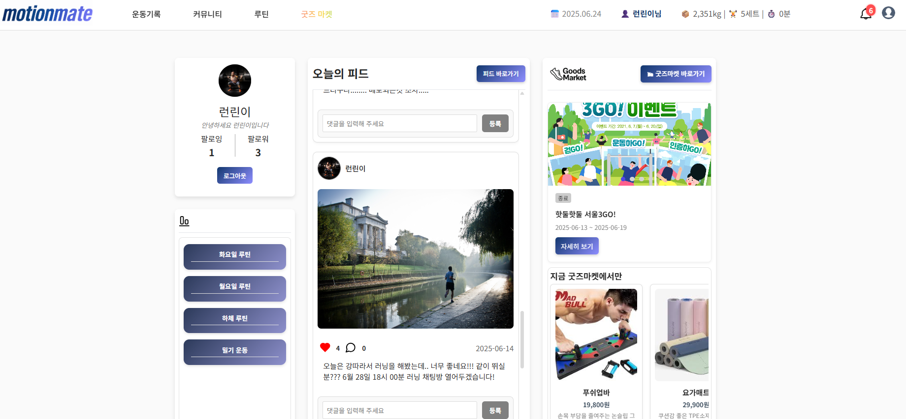

## 💪 운동 기록 기능

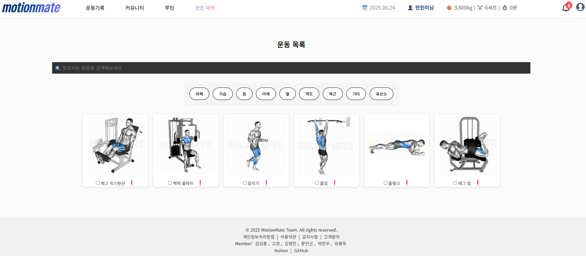  
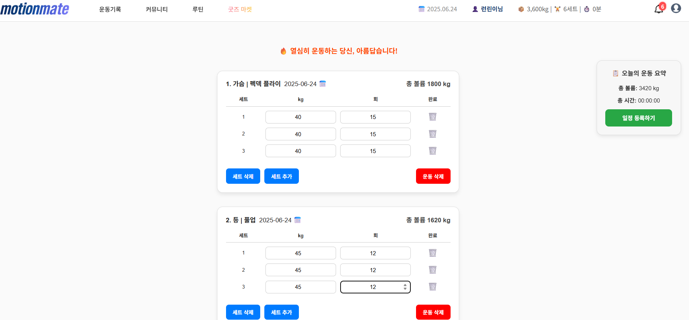  
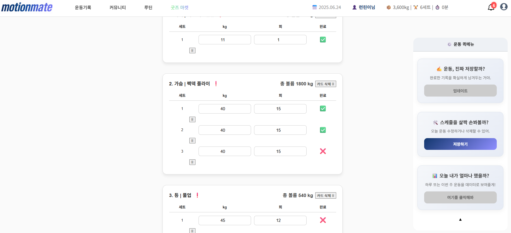  
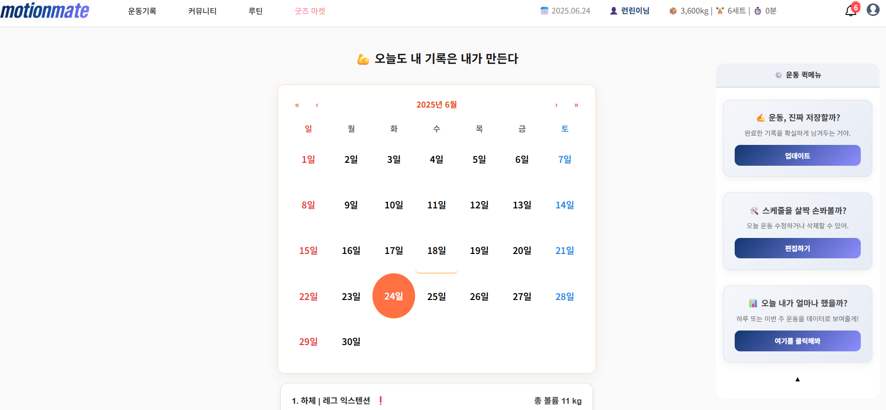  
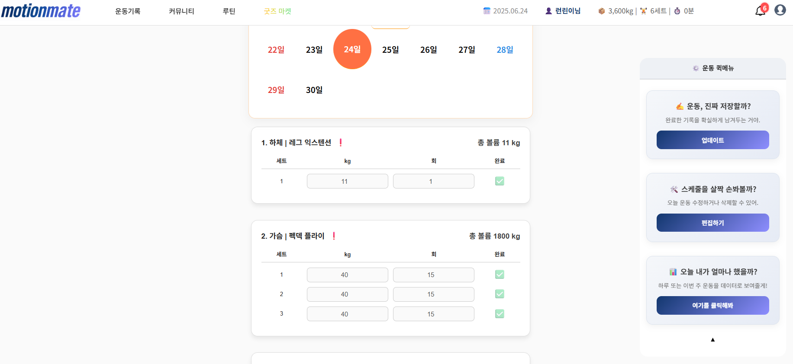  
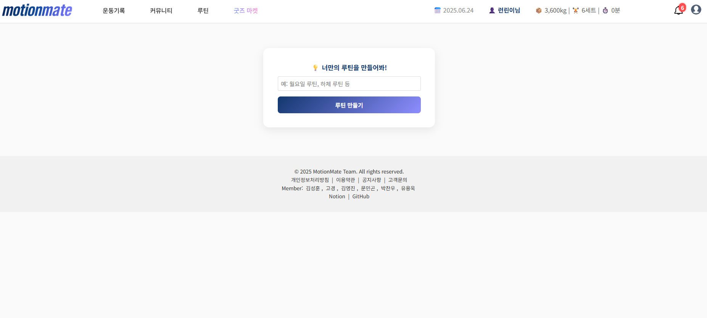  
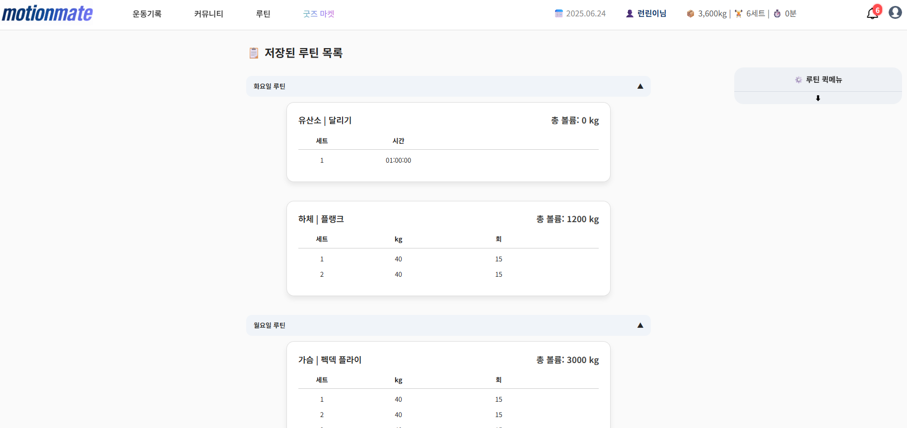

## 📷 피드(SNS)

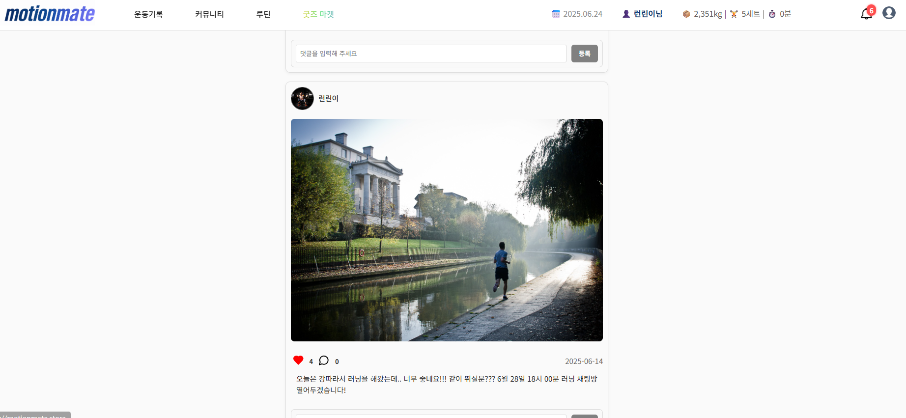  
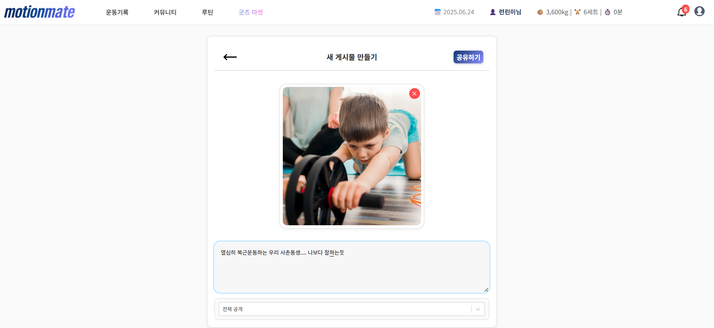  
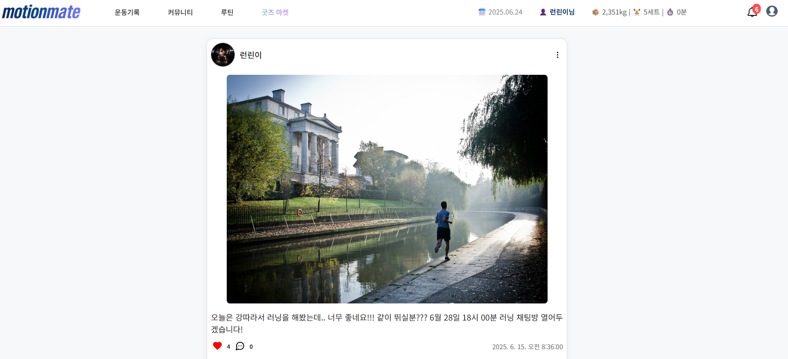

## 💬 채팅

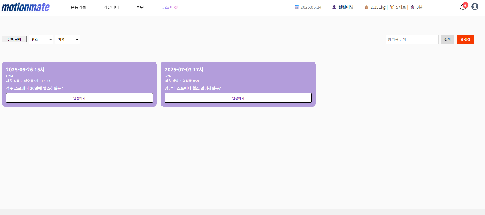  
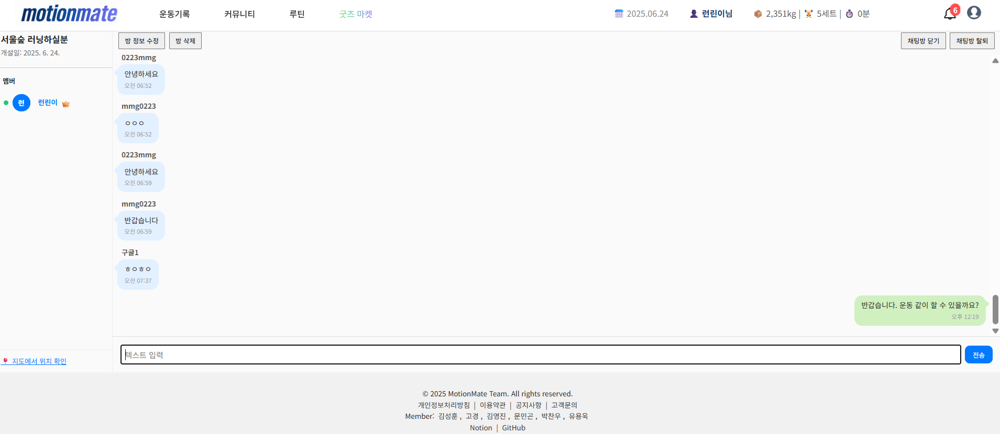  
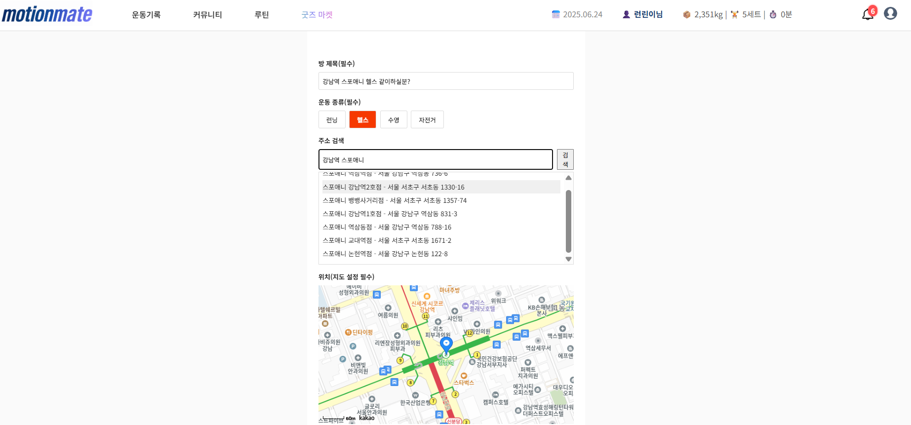

## 🛍️ 굿즈 마켓

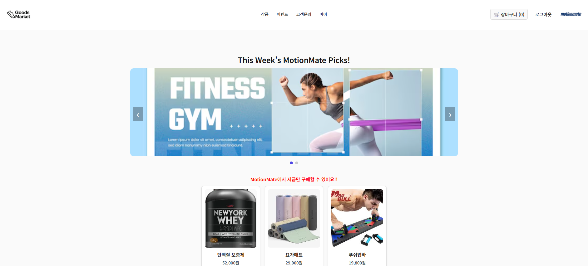  
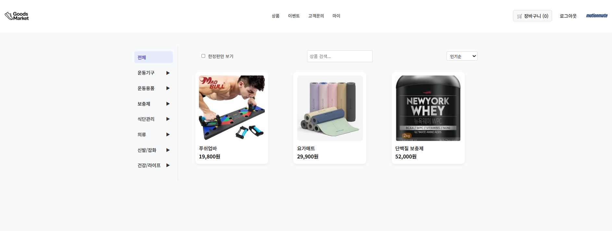  
  
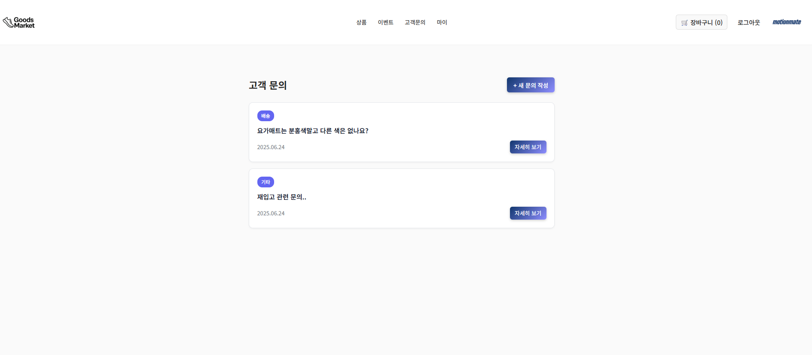  
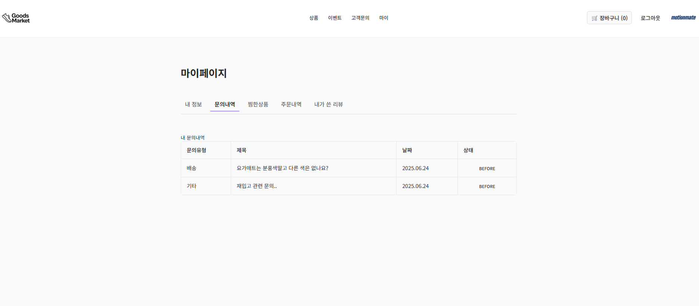

## 🛠️ 기술 스택
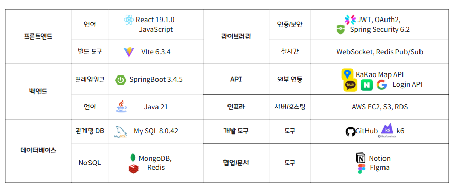

## 🧩 주요 기능 요약

| 기능             | 설명                                                  |
|----------------|-----------------------------------------------------|
| 소셜 로그인       | 구글, 네이버, 카카오 OAuth2 로그인 지원               |
| 운동 기록 및 루틴 | 운동 기록 + 루틴 생성 및 실행                        |
| 피드 기능         | 이미지 업로드, 댓글, 좋아요 포함 SNS 기능             |
| 실시간 채팅       | WebSocket + Redis 기반 채팅방                        |
| 굿즈 마켓         | 쇼핑몰 기능 (목록, 주문, 배송 관리 등)                |
| 이미지 업로드     | S3 업로드 (temp/upload 분리)                          |
| 마이페이지        | 운동, 피드, 주문 내역 통합 조회                       |

## 🚀 퍼포먼스 최적화

### 채팅 Redis Pub/Sub


### 운동기록 N+1 해결


### 굿즈 선착순 동시성 제어


## ✅ 요약

* 소셜 로그인 / 실시간 기능 통합
* S3 업로드 / Redis Pub/Sub
* 성능 최적화, 동시성 제어까지 적용된 구조

```

